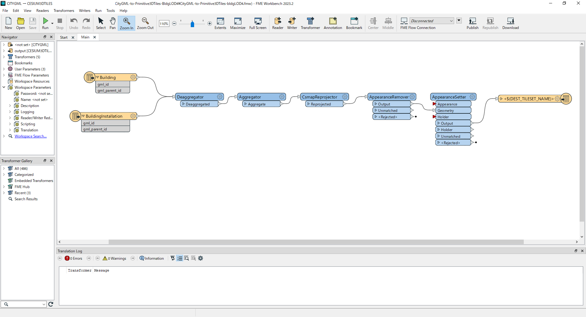

# CityGML建築物モデルLOD4からプリミティブ統合を伴う3DTilesへのコンバーター
 <!-- OSSの対象物のスクリーンショット（画面表示がない場合にはイメージ画像）を貼り付けください -->

## 1. 概要
本リポジトリでは、Project PLATEAUの令和６年度のユースケースの一部であるuc24-06「都市再生安全確保計画等の策定支援のための避難シミュレータの社会実装モデルの開発」において作成・利用した「CityGML-to-Primitive3DTiles-BldgLOD4」のデータ変換テンプレートを公開しています。  
本ユースケースにおいて、Unreal Engine上で避難シミュレーションを実行するにあたり、通常の3D都市モデル(3DTiles)を実装する場合、その属性やマテリアルが多数存在することからプリミティブが複雑になりバウンディングボリューム（一般的に衝突検出アルゴリズムにおいて可視化モデルの計算範囲を制限するための幾何学形状）の重なりが性能を悪化させることになります。  
本変換テンプレートでは、そのプリミティブを統合し3DTiles変換を行うことでシミュレーションがよりスムーズに実行されます。  
また、本変換テンプレートはFME Formのインストールを前提としており、はじめに[こちら](https://fme.safe.com/downloads/#official)からFME Formのインストールを行ってください。

## 2. 「都市再生安全確保計画等の策定支援のための避難シミュレータの社会実装モデルの開発」について
「都市再生安全確保計画等の策定支援のための避難シミュレータの社会実装モデルの開発」では、3D都市モデルとエリア防災計画に基づく人流データ等を用いて、避難者の人流をシミュレーションするシステムを開発し、本システムの避難シミュレーションを実施・検証することで、実効性のある防災計画・防災マニュアル等の策定を支援します｡  
そのなかで避難シミュレータ(Unreal Engine)に実装するためのプリミティブ統合を伴う3DTilesへの変換テンプレートを利用します。  
本ユースケースの詳細については技術検証レポート( https://xxxx )を参照してください。

## 3. 利用手順
本システムの構築手順及び利用手順については[利用チュートリアル]( https://r5-plateau-acn.github.io/SolarPotential/ )を参照してください。
- FME Formを[こちら](https://fme.safe.com/downloads/#official)からインストールします。
- 本リポジトリの一式をダウンロードし、任意のディレクトリに置きます。
- FME Formで「CityGML-to-Primitive3DTiles-BldgLOD4.fmw」を開いて実行します。
- ”Run” を実行して3DTilesデータを出力します。
- 出力された3DTilesデータの「data」フォルダ及び「tileset.json」を最終整理します。

詳細な手順は、技術検証レポート( https://xxxx )を参照してください。

## 4. システム概要 <!-- OSS化対象のシステムが有する機能を記載ください。 -->
### 【3DTiles変換】
#### ①建築物モデルLOD4(CityGML)からプリミティブ統合を伴う3DTilesへの変換
- 建築物モデルLOD4(CityGML)について、属性やマテリアルを1つのボリュームに統合された状態(プリミティブ統合)の3DTilesへ変換を行います。

## 5. 利用技術

| 名称   | バージョン | 内容 |
| --------|-------------|-----------------------------|
| FME Form | 2023.2.3 | 本変換テンプレートを実行するためのソフトウェア |

## 6. 動作環境 
| 項目               | 推奨動作環境                                                                                                                                                                                                                                                                                                                                    | 
| ------------------ | ---------------------------------------------------------- | 
| OS                 | Microsoft Windows 10 | 
| CPU                | 13th Gen Intel(R) Core(TM) i9-13900K   3.00 GHz以上 |                                                                                                                                 
| メモリ             | 64GB以上   |
| GPU                | NVIDIA RTX A4500以上  | 
| ストレージ         | 1TB SSD以上 |

## 7. 本リポジトリのフォルダ構成 <!-- 本GitHub上のソースファイルの構成を記載ください。 -->
| フォルダ名 |　詳細 |
|-|-|
| /sample(CityGML)/ | ワークベンチを試行するためのサンプルデータ |
| /src/CityGML-to-Primitive3DTiles-BldgLOD4.fmw | 起動用のデータ |
| /src/resources | ワークベンチのリソースデータ |

## 8. ライセンス

- ソースコード及び関連ドキュメントの著作権は国土交通省に帰属します。
- 本ドキュメントは[Project PLATEAUのサイトポリシー](https://www.mlit.go.jp/plateau/site-policy/)（CCBY4.0及び政府標準利用規約2.0）に従い提供されています。

## 9. 注意事項

- 本リポジトリは参考資料として提供しているものです。動作保証は行っていません。
- 本リポジトリについては予告なく変更又は削除をする可能性があります。
- 本リポジトリの利用により生じた損失及び損害等について、国土交通省はいかなる責任も負わないものとします。

## 10. 参考資料 
- 技術検証レポート: https://xxxx
- PLATEAU WebサイトのUse caseページ「都市再生安全確保計画等の策定支援のための避難シミュレータの社会実装モデルの開発」: https://xxxx

