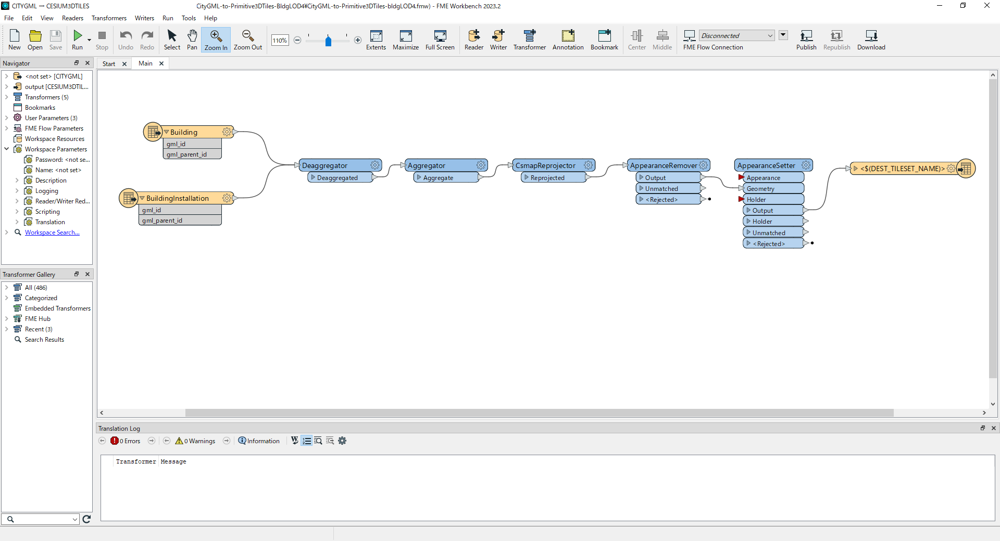

# CityGML建築物モデルLOD4からプリミティブ統合を伴う3DTilesへの変換を行うコンバーター

Project PLATEAUの令和６年度のユースケースの一部であるuc24-06「都市再生安全確保計画等の策定支援のための避難シミュレータの社会実装モデルの開発」において作成・利用した「CityGML-to-Primitive3DTiles-BldgLOD4」のデータ変換テンプレートで、
建築物モデルLOD4(CityGML)からプリミティブ統合を伴う3DTilesへの変換を行うテンプレートです。  
 
本ユースケースにおいて、Unreal Engine上で避難シミュレーションを実行するにあたり、通常の3D都市モデル(3DTiles)を実装する場合、その属性やマテリアルが多数存在することからプリミティブが複雑になりバウンディングボリューム（一般的に衝突検出アルゴリズムにおいて可視化モデルの計算範囲を制限するための幾何学形状）の重なりが性能を悪化させることになります。
本変換テンプレートでは、そのプリミティブを統合し3DTiles変換を行うことでシミュレーションがよりスムーズに実行されます。

||
|:-:|