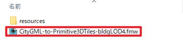
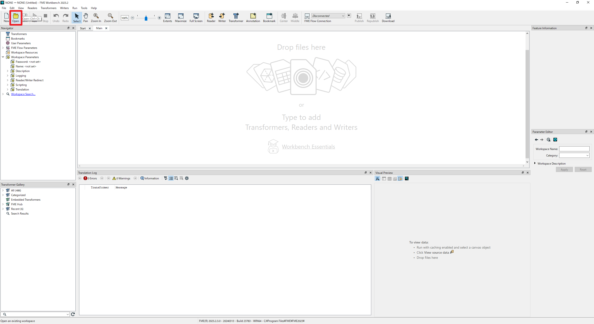

# 環境構築手順書

# 1 本書について

本書では、CityGML建築物モデルLOD4からプリミティブ統合を伴う3DTilesへの変換を行うコンバーター（以下「本システム」という。）の利用環境構築手順について記載しています。本システムの構成や仕様の詳細については以下も参考にしてください。  
[技術検証レポート](https://xxxx)

||
|:-:|

# 2 動作環境

本システムの動作環境は以下のとおりです。

| 項目               | 推奨動作環境                                                                                                                                                                                                                                                                                                                                    | 
| ------------------ | ---------------------------------------------------------- | 
| OS                 | Microsoft Windows 10 | 
| CPU                | 13th Gen Intel(R) Core(TM) i9-13900K   3.00 GHz以上 |                                                                                                                                 
| メモリ             | 64GB以上   |
| GPU                | NVIDIA RTX A4500以上  | 
| ストレージ         | 1TB SSD以上 |
| FME Form　         | 2023.2.3   |

# 3 利用手順

- FME Formを[こちら](https://fme.safe.com/downloads/#official)からインストールします。  
　※インストールに関する詳しい手順は[FMEサポート](https://fmesupport.com/2019/11/qa-fme-free-licenses/)にアクセス・お問い合わせをお願いします。  
- 本リポジトリの一式をダウンロードし、任意のディレクトリに置きます。
- FME Formの「Open」からダウンロードした「CityGML-to-Primitive3DTiles-BldgLOD4.fmw」を起動します。

||
|:-:|