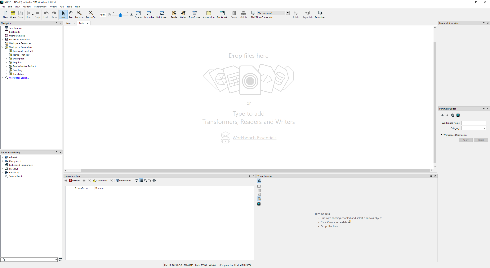
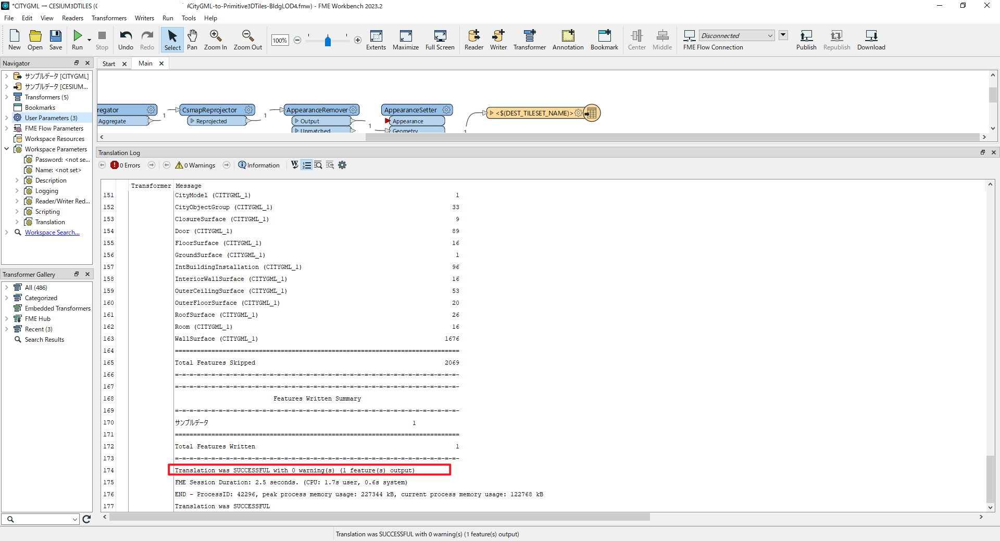

# 操作マニュアル

# 1 本書について

本書では、CityGML建築物モデルLOD4からプリミティブ統合を伴う3DTilesへの変換を行うコンバーター（以下「本システム」という。）の利用環境構築手順について記載しています。

# 2 変換テンプレートの起動

・本システムの実行ソフトウェア「FME Form」を[インストール](https://fme.safe.com/downloads/#official)し、実行すると以下の画面が表示されます。

||
|:-:|

 
 
・FME Formの「Open」からダウンロードした「CityGML-to-Primitive3DTiles-BldgLOD4.fmw」を起動します。

||
|:-:|

||
|:-:|

# 3 変換テンプレートの実行と変換出力

・「User Parameters」を右クリックし、「Edit User Paramter Default Values…」を選択します。

||
|:-:|

 
 
・「建築モデルデータ」にCityGMLデータを選択し、「変換結果出力先フォルダ」と「3DTilesタイルセット名」を設定します。

||
|:-:|

 
 
・「建築モデルデータ」、「変換結果出力先フォルダ」と「3DTilesタイルセット名」の設定が終わったら「Save as Defaults」をクリックします。

||
|:-:|

 
 
・「Run」をクリックし、CityGMLを3DTilesに変換する作業は完了となります。

||
|:-:|

 
 
・実行後、「Translation was SUCCESSFUL」とでれば出力成功です。

||
|:-:|

# 4 出力データの整理(最終処理)

・3DTileフォルダの「data」を開きます。

||
|:-:|

 
 
・「data1.b3dm」を削除します。

||
|:-:|

 
 
・「tileset.json」をテキストエディタで開きます。

||
|:-:|

 
 
・Unreal Engineに実装した際に移動可能領域の再生成が起こってしまうため、チルドレン要素を削除し親要素のみのデータにする必要があるため、図のように「REPLACE」を削除し「ADD」を入力します。

||
|:-:|

 
 
・下の図のように「data1.b3dm」を「data0.b3dm」にします。

||
|:-:|

 
 
・下の図のように、チルドレン要素を削除します。

||
|:-:|

 
 
・「上書き保存」をクリックし、テキストエディタを閉じます。

||
|:-:|

 
 