# 操作マニュアル

# 1 本書について

本書では、CityGML-to-Primitive3DTiles-BldgLOD4（以下「本システム」という。）の利用環境構築手順について記載しています。

# 2 使い方

## 2-1 トップ画面

本システムの実行ソフトウェア「FME Form」を実行すると以下の画面が表示されます。

・「Open」より実行するデータ変換テンプレート(.fmw)を開きます。

|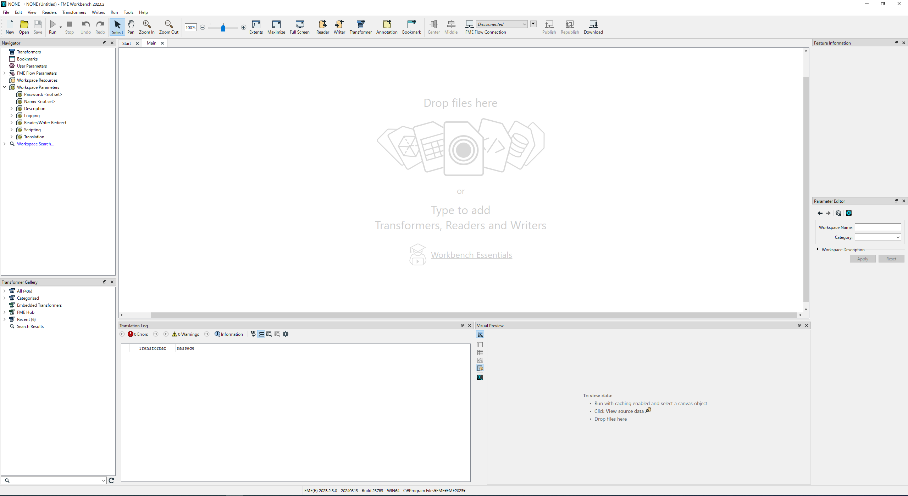|
|:-:|

## 2-2 CityGML-to-Primitive3DTiles-BldgLOD4.fmwの操作

・「User Parameters」を右クリックし、「Edit User Paramter Default Values…」を選択します。

|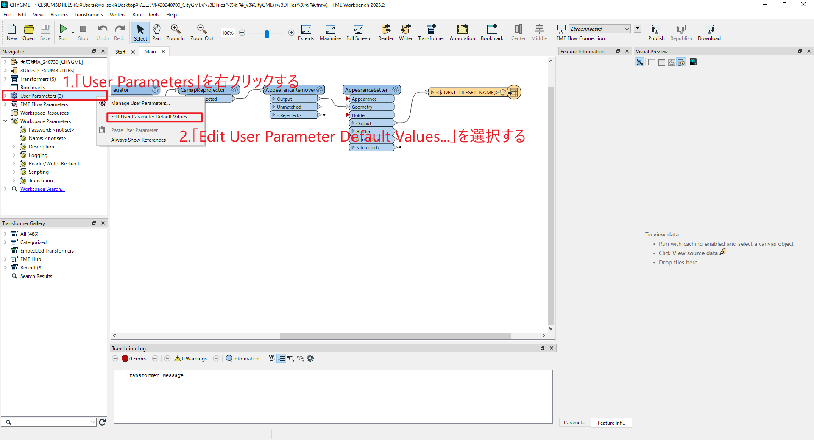|
|:-:|

 
 
・「建築モデルデータ」にCityGMLデータを選択し、「変換結果出力先フォルダ」と「3DTilesタイルセット名」を設定します。

|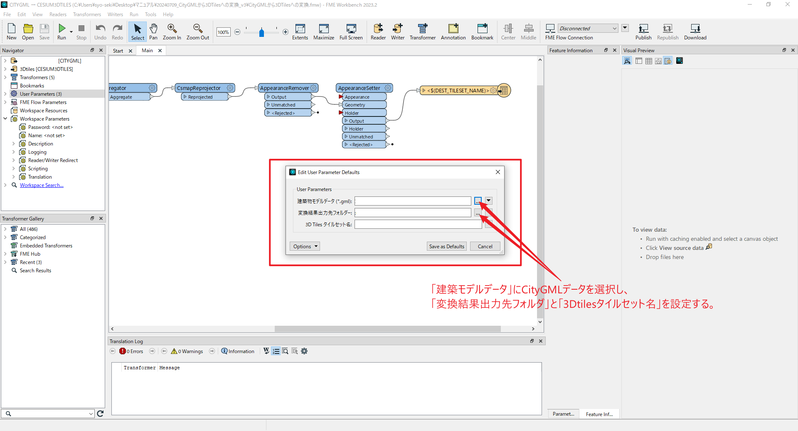|
|:-:|

 
 
・「建築モデルデータ」、「変換結果出力先フォルダ」と「3DTilesタイルセット名」の設定が終わったら「Save as Defaults」をクリックします。

|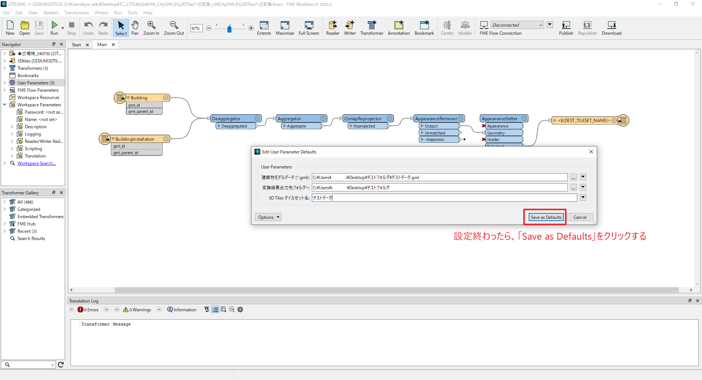|
|:-:|

 
 
・「Enable Feature Caching」はチェックが入った状態だと処理に時間がかかってしまうため、「Run」のメニューを選択し、「Enable Feature Caching」のチェックを外します。

|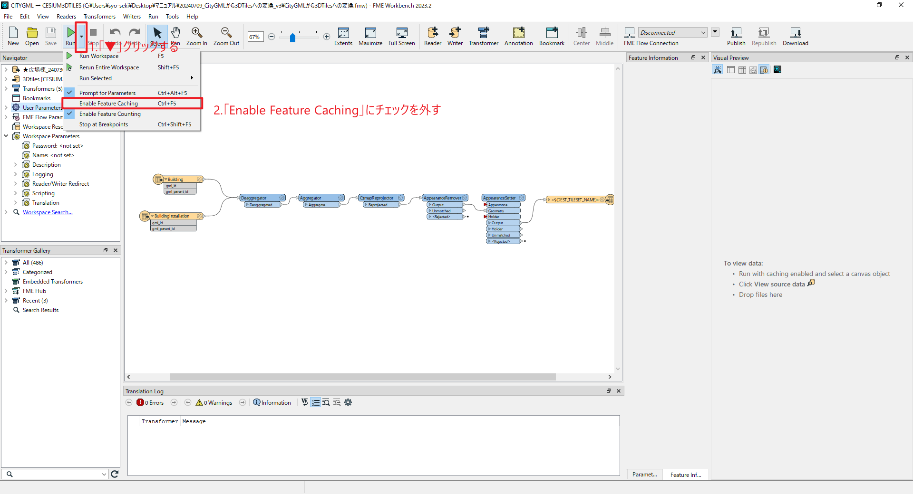|
|:-:|

 
 
・「Run」をクリックし、CityGMLを3DTilesに変換する作業は完了となります。

|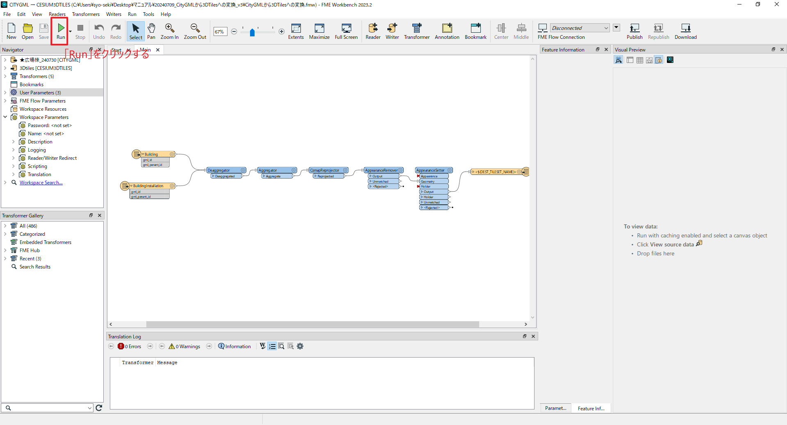|
|:-:|

 
 

# 3 出力データ
CityGMLから3DTilesへの変換は完了となっても、変換された3DTilesの建築物モデルのバウンディングボリュームがシミュレーション区域のバウンディングボリュームに重畳してしまうため、3DTilesデータの修正が必要となります。
以下に、3DTilesデータについての具体的な処理内容を記載します。

・3DTileフォルダの「data」を開きます。

|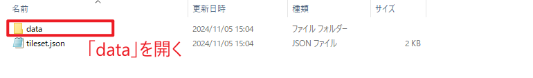|
|:-:|

 
 
・「data1.b3Dm」を削除します。

|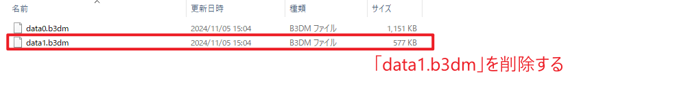|
|:-:|

 
 
・「tileset.json」をテキストエディタで開きます。

|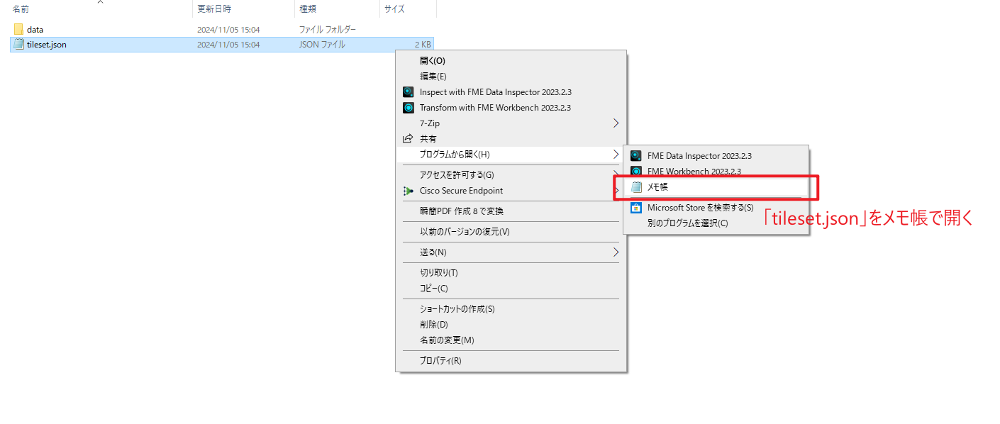|
|:-:|

 
 
・Unreal Engineに実装した際に移動可能領域の再生成が起こってしまうため、チルドレン要素を削除し親要素のみのデータにする必要があります。これに対応すべく、図のように「REPLACE」を削除し「ADD」を入力します。

|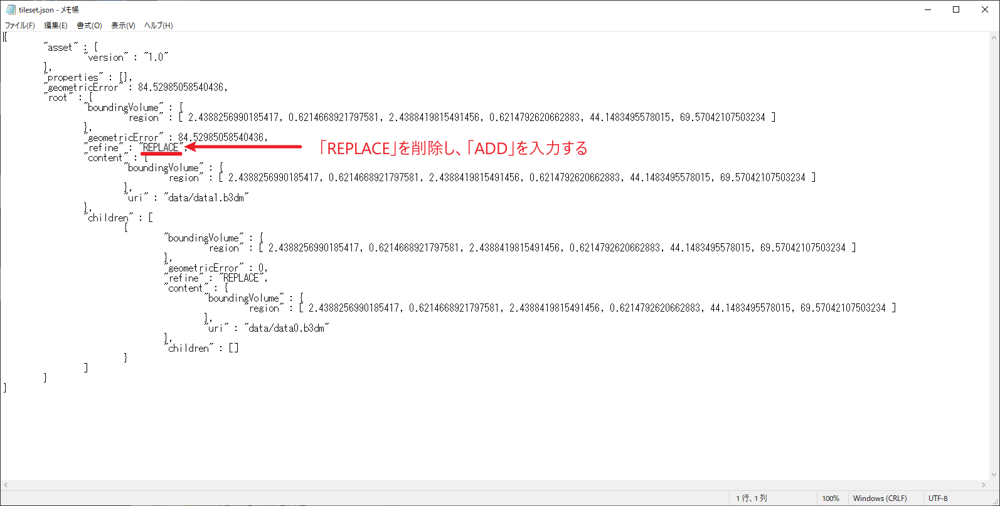|
|:-:|

 
 
・下の図のように「data1.b3Dm」を「data0.b3Dm」にします。

|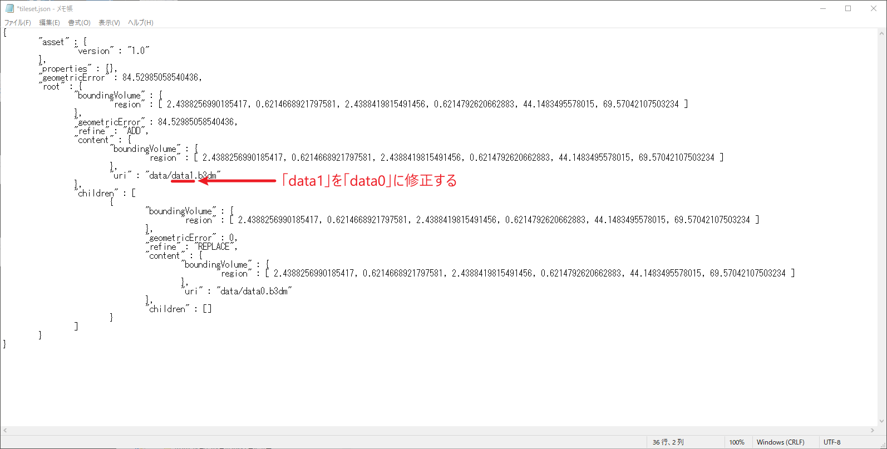|
|:-:|

 
 
・下の図のように、チルドレン要素を削除します。

|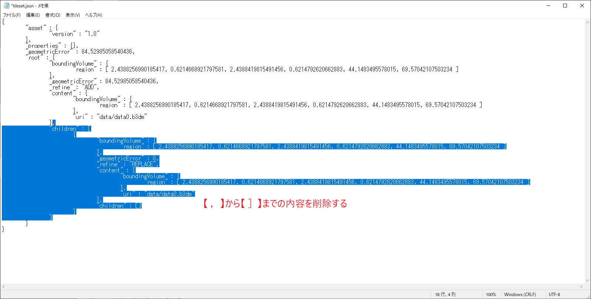|
|:-:|

 
 
・「上書き保存」をクリックし、テキストエディタを閉じます。

|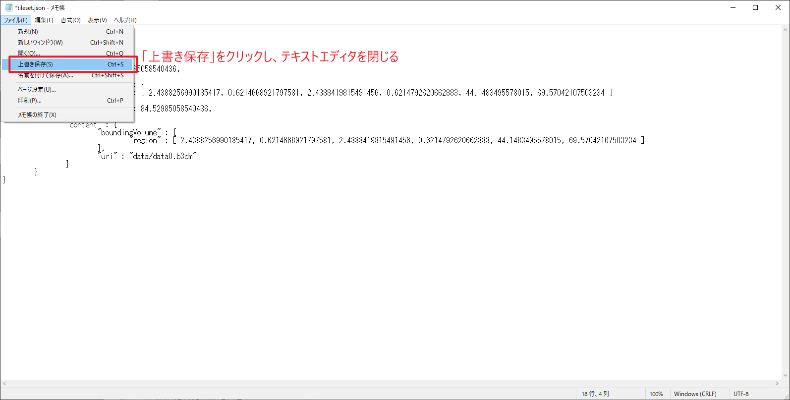|
|:-:|

 
 
・3DTilesデータをZip化し、CityGMLからプリミティブ統合を伴う3DTilesへの変換作業は完了となります。

|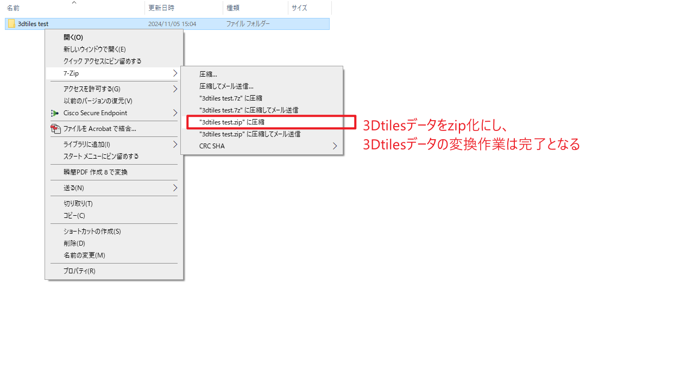|
|:-:|

 
 
